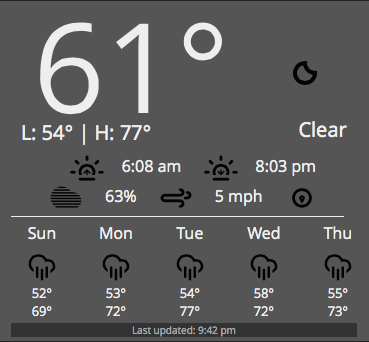

#Forecast.io Dashing Widget
##Description
Simple [Dashing](http:shopify.github.io/dashing) widget to display weather information from [Forecast.io](http://forecast.io).

##Screenshot

##Dependencies

This widget needs `json` and `date` run. You can install them by:

    sudo gem install json date
    bundle

Additionally add them to your Gemfile.

##Usage

Move the files to the following locations:

* /widgets/forecastio
	* forecastio.html
	* forecastio.coffee
	* forecastio.scss
* /jobs
	* forecastio.rb
* /assets/images
	* climacons

To include the widget in a dashboard, add the following snippet to the dashboard layout file:

    <li data-row="1" data-col="1" data-sizex="1" data-sizey="1">                
      

                     
    </li>

