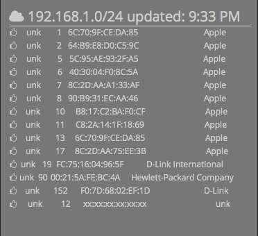

#Netscan Dashing Widget
##Description
Simple [Dashing](http:shopify.github.io/dashing) widget to display devices attached to your network.

##Screenshot

##Dependancies

This widget requires `nokogiri` to parse the XML produced by Nmap after its scan. You can install nmap on OSX using the [brew](http://brew.sh) command:

    brew update
    brew install nmap

You can then install `nokogiri` by:

    sudo gem install nokogiri
    bundle

Additionally add `nokogiri` to the `Gemfile`.

##Usage

Move the files to the following locations:

* /widgets/netscan
	* netscan.html
	* netscan.coffee
	* netscan.scss
* /jobs
	* netscan.rb

You can edit the `netscan.rb` to adjust it for your network or change the time between network scans. In order to get access to all the data fields, the program must be run as root, so do:

    sudo dashing start

To include the widget in a dashboard, add the following snippet to the dashboard layout file:

    <li data-row="1" data-col="1" data-sizex="1" data-sizey="1">
      

    </li>

