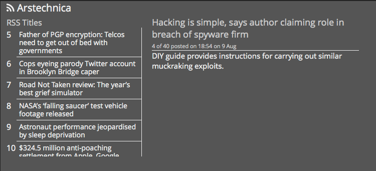

#RSS Dashing Widget
##Description
Simple [Dashing](http:shopify.github.io/dashing) widget to display RSS feeds.

##Screenshot

##Dependancies

This widget needs `feedjira` to parse the RSS feeds.

    sudo gem install feedjira
    bundle

##Usage

Move the files to the following locations:

* /widgets/rss
	* rss.html
	* rss.coffee
	* rss.scss
* /jobs
	* rss.rb

To include the widget in a dashboard, add the following snippet to the dashboard layout file:

    <li data-row="1" data-col="1" data-sizex="2" data-sizey="1">
      

    </li>

Feel free to configure the `data-interval` attribute to change how long information is displayed for. Additionally, modify `rss.rb` to point it at your favorite RSS feed.

